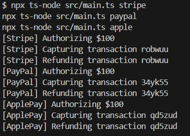

# Домашнє завдання до Теми Породжувальні патерни: Фабрика й Абстрактна фабрика

У реальних застосунках робота з платіжними системами — це завжди про змінність, залежності й масштабованість. У цьому завданні ви навчитеся відділяти створення об’єктів від їх використання за допомогою **патернів Factory Method і Abstract Factory**, що дає змогу будувати гнучкі, модульні та розширювані системи. Це базовий крок до створення архітектур, які легко адаптуються під зміну бізнес-вимог і технологій.

### Опис завдання

Необхідно реалізувати імітаційну архітектуру платіжної системи, яка підтримує кілька провайдерів: `Stripe`, `PayPal` і `ApplePay`. Кожен провайдер реалізує однакову функціональність: `authorize → capture → refund`.

Завдання полягає в застосуванні патернів Factory Method та Abstract Factory, щоб:

- відокремити логіку створення об’єктів;
- спростити розширення системи новими провайдерами;
- приховати використання `new` за фабричним шаром.

Це завдання не передбачає використання реальних платіжних систем чи SDK. Реалізація платіжних сервісів є імітацією і виконується через `console.log`.

Приклад:

```tsx
console.log(`[Stripe] Authorizing $${amount}`);
...
console.log(`[ApplePay] Refunding transaction ${transactionId}`);
```

### Завдання

## Структура проєкту

```
/src
  /core
    PaymentProvider.ts        # Інтерфейс платіжного провайдера
    PaymentProviderFactory.ts # Інтерфейс фабрики провайдерів
  /providers
    /stripe
      StripePaymentProvider.ts # Реалізація Stripe провайдера
      StripeFactory.ts         # Фабрика для Stripe
    /paypal
      PaypalPaymentProvider.ts # Реалізація PayPal провайдера
      PaypalFactory.ts         # Фабрика для PayPal
    /apple
      ApplePaymentProvider.ts  # Реалізація Apple Pay провайдера
      AppleFactory.ts          # Фабрика для Apple Pay
  /app
    PaymentContext.ts         # Контекст для роботи з провайдерами
  main.ts                    # Приклад використання
package.json
tsconfig.json
```

### Очікуваний результат

- Усі класи `XxxPaymentProvider` реалізують `PaymentProvider`;
- Усі класи `XxxFactory` реалізують `PaymentProviderFactory`;
- Клас `PaymentContext` працює з будь-якою фабрикою через інтерфейс;
- В `main.ts` реалізовано сценарій повного платіжного циклу з обраним провайдером;
- Весь код типізовано, він не використовує `new` поза фабриками, і легко розширюється.

## Застосовані патерни

### Factory Method

- Використовується для створення конкретних платіжних провайдерів
- Кожен провайдер (Stripe, PayPal, Apple Pay) має свою фабрику
- Фабрики реалізують інтерфейс `PaymentProviderFactory`

### Abstract Factory

- Інтерфейс `PaymentProviderFactory` визначає спосіб створення провайдерів
- Дозволяє створювати сімейства пов'язаних об'єктів
- Забезпечує можливість легко додавати нові провайдери

## Запуск проекту

```bash
# Запуск з Stripe провайдером
npx ts-node src/main.ts stripe

# Запуск з PayPal провайдером
npx ts-node src/main.ts paypal

# Запуск з Apple Pay провайдером
npx ts-node src/main.ts apple
```

При запуску програма:

1. Створює відповідну фабрику провайдера
2. Ініціалізує контекст платежів
3. Виконує повний цикл операцій (authorize, capture, refund)

## 📦 Структура проєкту

Проєкт реалізує патерни Factory Method і Abstract Factory для платіжної системи.

- `/core` — інтерфейси PaymentProvider та PaymentProviderFactory
- `/providers` — реалізації Stripe, PayPal, ApplePay
- `/app` — клас PaymentContext
- `main.ts` — запуск сценарію

## 🧩 Використані патерни

- Factory Method
- Abstract Factory

## ▶️ Запуск

npx ts-node src/main.ts stripe
npx ts-node src/main.ts paypal
npx ts-node src/main.ts apple

## ▶️ РЕЗУЛЬТАТ


